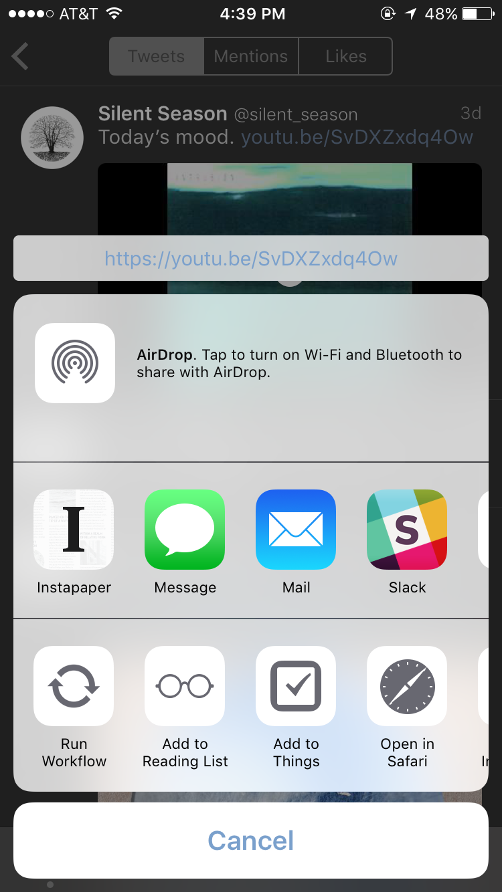
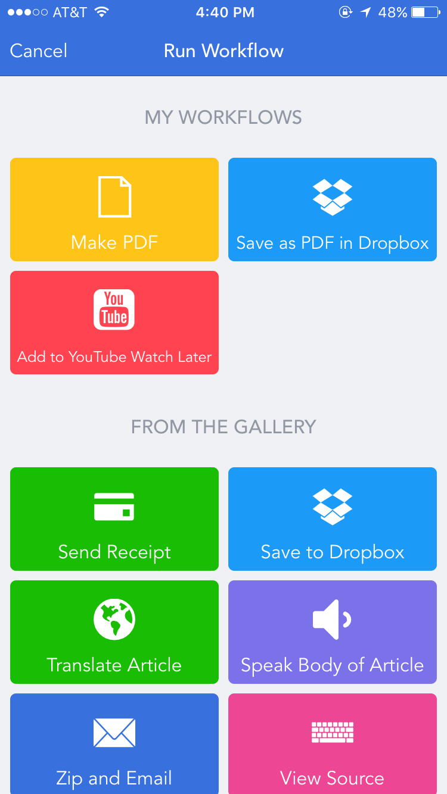
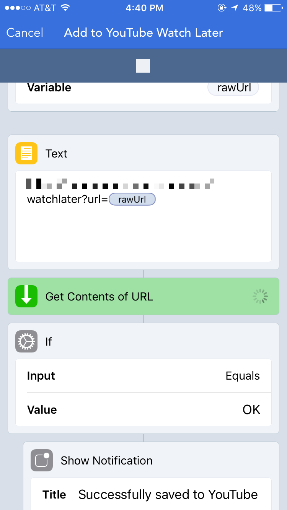

# Usage

I usually use this workflow when reading my twitter feed. When I find a video I want to watch later, I tap and hold on the URL to invoke the share menu. Select "Run Workflow":

Then choose the "Add to YouTube Watch Later" workflow:

Worflow will then run through it's script, calling out to the web service

If all goes well, you'll get a notification confirming that the URL was loaded.

